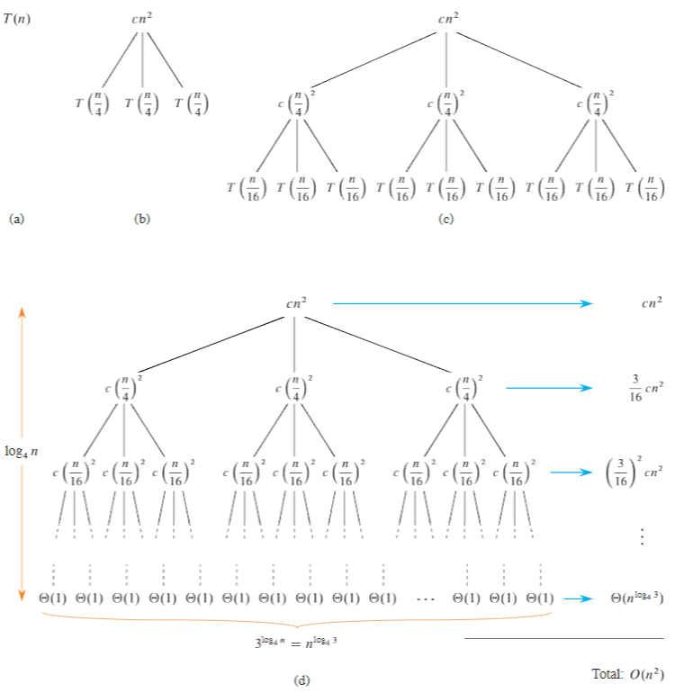

### 分治策略

利用分治策略递归地求解一个问题：
- 分解（*Divide*）：将问题划分为一些子问题，子问题的形式与原问题一样，但规模更小。
- 解决（*Conquer*）：递归地求解子问题。问题规模足够小时，停止递归并直接解决。
- 合并（*Combine*）：将子问题的解组合成原问题的解。

>---
### 递归式

递归（*recursion*）通过不断逐层调用自身（递）直至达到终止条件时开始逐层返回（归），以解决一些算法问题。更多表现在将原问题分解为更多的子问题分治解决。

> *迭代*
> >
> >迭代（*iteration*）是一种重复执行某个任务的控制结构，直至条件不满足时停止迭代。常见有 `for` 迭代一定次数或 `while` 循环直至不满足条件控制。
> >
> >通常递归比迭代更耗费空间，函数调用也会产生额外的开销从而增加时间成本，因此时间效率也会更低。递归的深度受本地内存环境的限制，实际允许的递归深度通常是有限的。过高的深度可能会导致栈溢出。

当一个算法包含对其自身的调用时，可以用递归式或递归方程来描述其运行时间，递归式根据在较小输入规模上的运行时间来描述在规模为 $n$ 的问题上的总运行时间 $T(n)$。

当分治策略的子问题足够大时需要递归求解的情况为递归情况（*recursive case*）；当子问题规模足够小不需要递归时，则进入了基本情况（*base case*）。递归式与分治方法紧密相关，使用递归式可以自然地刻画分治算法的运行时间。一个递归式可以是一个等式或不等式，它通过更小输入规模上的函数值来描述一个函数。

分治算法运行时间的递归式来自基本模式的三个步骤。若问题规模足够小，例如对某个常量 $c$ 有 $n \leq c$，则所需的常量时间为 $Θ(1)$；假设将原问题分解为 $a$ 个子问题，每个子问题的规模是原问题的 $1/b$，则求解一个规模为 $n/b$ 的子问题需要 $T(n/b)$ 的时间，一共需要 $aT(n/b)$ 的时间来求解 $a$ 个子问题；分解时间需要 $D(n)$，合并子问题需要 $C(n)$，那么一个分治算法的递归式为：

$$T(n) = \begin{cases} Θ(1), & \text {if {$n \leq c$}}  \\
 aT(n/b) + D(n) + C(n), & \text{other} \end{cases}$$

如果对于每一个足够大的阈值常数 $n_0 > 0$，满足：
- 所有的 $∀ n < n_0$，$T(n) = Θ(1)$；
- 所有的 $∀ n \ge n_0$，在有限数量的递归调用中，每个递归路径都终止于一个实现定义的基本情况。

则描述分治算法运行时间 $T(n)$ 的递归式是合乎逻辑的（*algorithmic*）。

>---
### 求解递归式
#### 代入法求解

代入法包括两个步骤：
- 使用符号常数猜测解的形式；
- 利用数学归纳法证明解成立，并求解出其中的常数。

可以用代入法来确定递归式的上界或下界，例如先证明 $O$，再证明 $Ω$，最后确定递归式的 $Θ$；例如 $T(n) = 2T(\lfloor n/2 \rfloor) + Θ(n)$，与归并排序 $n>1$ 时的运行时间递归式相似，猜测它的解为 $T(n) = O(n \lg n)$：
- 归纳假设 $T(n) \leq cn \lg n, n \geq n_0$，$c > 0, n_0 > 0$；该界假设适用于至少大于 $n_0$ 且小于 $n$ 的所有数。如果 $n \geq 2n_0$，则适用于 $\lfloor n/2 \rfloor$，即 $T(\lfloor n/2 \rfloor) \leq c \lfloor n/2 \rfloor \lg (\lfloor n/2 \rfloor)$，因此；
- $T(n) \leq 2(c \lfloor n/2 \rfloor \lg(\lfloor n/2 \rfloor)) + Θ(n) \\\ \qquad \leq 2(c(n/2) \lg(n/2)) + Θ(n)  \\\ \qquad = cn \lg(n/2) + Θ(n) \\\ \qquad = cn \lg n - cn  \lg2 + Θ(n) \\\ \qquad = cn \lg n - cn + Θ(n) \\\ \qquad \leq cn \lg n$；
- 渐近记号仅要求对 $n \geq n_0$ 证明 $T(n) \leq cn \lg n$，保留不符合基本情况的边界 $n = 1$，可以观察到对于 $n > 1$，对某个常数 $c \ge 1$，$T(n) \leq cn \lg n$，可以选择一个足够大的 $c$；
- 因此对于所有的 $n \ge 2$，有 $T(n) \leq cn \lg n$，即 $T(n) = Θ(n \lg n)$。

> 常见的递归式

- $T(n)  = T(n-1) + n$ 有解 $T(n) = O(n^2)$
- $T(n)  = T(n/2) + Θ(1)$ 有解 $T(n) = O(\lg n)$
- $T(n)  = 2T(n/2) + n$ 有解 $T(n) = Θ(n \lg n)$
- $T(n)  = 2T(n/2 + 17) + n$ 有解 $T(n) = O(n \lg n)$
- $T(n)  = 2T(n/3) + Θ(n)$ 有解 $T(n) = Θ(n)$
- $T(n)  = 4T(n/2) + Θ(n)$ 有解 $T(n) = Θ(n^2)$

>---
#### 递归树求解

递归树适用于生成正确的猜测解，并通过代入法进行验证。精确的递归树甚至可以作为递归式解的直接证明。

假设一个 $T(n) = 3T(n/4) + Θ(n^2)$：

子问题的规模在每一步减少为上一步的 $1/4$，所以递归最终必须在 $n < n_0$ 的基本情况下到达最低点；约定 $n < n_0$ 时 $T(n) = Θ(1)$，其中 $n_0 > 0$ 表示为任意足够大的阈值常数，以更好的定义递归式。从根节点到 $Θ(1)$ 的子问题有：

$
T(n) = cn^2 + \frac{3}{16}cn^2 + (\frac{3}{16})^2cn^2+ ... + (\frac{3}{16})^{\log_4n}cn^2 + Θ(n^{\log_43}) \\\
\qquad = \sum_{i=0}^{\log_4n} (\frac{3}{16})^i cn^2 + Θ(n^{\log_43}) \\\
\qquad < \sum_{i=0}^{ \infin } (\frac{3}{16})^i cn^2 + Θ(n^{\log_43}) \\\
\qquad = \frac{1}{1-(3/16)}cn^2 +  Θ(n^{\log_43}) \\\
\qquad = \frac{16}{13} cn^2 +  Θ(n^{\log_43}) \\\
\qquad = Θ(n^{\log_43}) = O(n^{0.8}) =  O(n^2)
$

$O(n^2)$ 是 $T(n)$ 的一个上界，第一次递归调用的代价是 $Θ(n^2)$，则 $Ω(n^2)$ 一定是递归的下界。代入法验证对于某个常数 $d > 0$，证明 $T(n) < dn^2$；选择常数 $c > 0$：

$
T(n) \leq 3T(n/4) + cn^2 \leq 3d(n/4)^2 + cn^2 = \frac{3}{16}dn^2 + cn^2 \leq dn^2
$

当选择 $d \leq \frac{16}{13}c$，$T(n) = O(n^2)$。对于 $n_0 > 0$ 是一个足够大的阈值常数，使得当 $n < n_0$ 时 $T(n) = Θ(1)$，选择一个足够大的 $d$，使得 $dn^2 \geq d \geq T(n)$，$1 \leq n < n_0$；因此完成基本情况的证明。

>---
#### 主方法求解

主方法一般求解形如 $T(n) = aT(n/b) + f(n)$ 的（主）递归式，其中 $a > 0, b > 1$ 是常数，$f(n)$ 为驱动函数。$f(n)$ 描述了在递归之前划分问题的代价，以及将子问题递归解合并在一起的代价。

$aT(n/b)$ 实际上可以看作是 $a_1T(\lfloor n/b\rfloor) + a_2T(\lceil n/b \rceil)$，其中 $a_1 \geq 0, a_2 \geq 0, a = a_1 + a_2$，则 $T(n)$ 的渐近行为可以表示为：
1. 如果存在一个常数 $α > 0$ 使得 $f(n) = O(n^{\log_ba-α})$，则 $T(n) = Θ(n^{\log_ba})$；
2. 如果存在一个常数 $k \geq 0$ 使得 $f(n) = Θ(n^{\log_ba} \lg^k n)$，则 $T(n) = Θ(n^{\log_ba} \lg^{k+1} n)$；
3. 若存在一个常数 $α > 0$ 使得 $f(n) = Ω(n^{\log_ba + α})$ 且对某常数 $c < 1$ 和所有足够大的 $n$ 满足正则性条件 $af(n/b) \le cf(n)$，则 $T(n) = Θ(f(n))$

将驱动函数 $f(n)$ 与分水岭函数 $g(n) = n^{\log_ba}$ 进行比较，若 $g(n)$ 具有更快的渐近速率则情况 1 适用；若 $f(n)$ 更快则情况 3 适用；大小相当时情况 2 适用。情况 2 中 $g(n)$ 和 $f(n)$ 几乎相同的渐近速率增长，但其中 $k \geq 0$ 时，$f(n)$ 略快，得到 $T(n) = Θ(n^{\log_ba} \lg^{k+1} n)$，大多数情况发生在 $k = 0$ 时，因此 $T(n) = Θ(n^{\log_ba} n)$。

例如 $T(n) = 9T(n/3) + n$，有 $a = 9, b = 3, f(n) = n$，因此 $g(n) = n^{\log_39} = Θ(n^2)$，由于 $f(n) = O(n^{\log_3{9-α}})$ 其中 $α = 1$，适用于情况 1，因此 $T(n) = Θ(n^2)$。

>---
#### Akra-Bazzi 法求解

*Akra-Bazzi* 方法适用于 $T(n) = f(n) + \sum_{i = 1}^{k} a_iT(n/b_i)$ 的递归式，其中 $a_i, b_i$ 是严格正实数且 $b_i > 1$；$f(n)$ 是一个非负函数，满足多项式增长条件：存在正常数 $c_1, c_2$ 使得对所有的 $n \ge 1$，$i = 1,2,...,k$ 以及所有满足 $b_in \le x \le n$ 的 $x$，有 $c_1 f(n) \le f(x) \le c_2 f(n)$。

若 $|f'(n)|$ 的上界是 $n$ 的某个多项式，则 $f(n)$ 满足多项式增长条件。例如对于任意常数 $a，b$，$f(n) = n^a \lg^bn$ 满足条件。

求解 *Akra-Bazzi* 递归式，首先寻找满足 $\sum_{i=1}^k a_i b_i^p = 1$ 的实数 $p$，$T(n) = Θ(n^p(1+ \int_1^n \frac{f(x)}{x^{p+1}}dx))$。

例如 $T(n) = T(n/5) + T(7n/10) + n$，有 $(\frac{1}{5})^p + (\frac{7}{10})^p = 1$，取 $(1/5)^0 + (7/10)^0 = 2$ 和 $(1/5)^1 + (7/10)^1 = 9/10$，则 $0 < p < 1$（实际 $p = 0.83978...$）。

$
T(n) = Θ(n^p(1+ \int_1^n \frac{f(x)}{x^{p+1}}dx)) \\\
\qquad =  Θ(n^p(1+ \int_1^n x^{-p}dx)) \\\
\qquad =  Θ(n^p(1+ \left[\frac{x^{1-p}}{1-p}\right]^n_1)) \\\
\qquad =  Θ(n^p(1 + (\frac{n^{1-p}}{1-p} - \frac{1}{1-p}))) \\\
\qquad =  Θ(n^p \cdot Θ(n^{1-p})) \qquad\qquad(1-p > 0) \\\
\qquad = Θ(n)
$

---